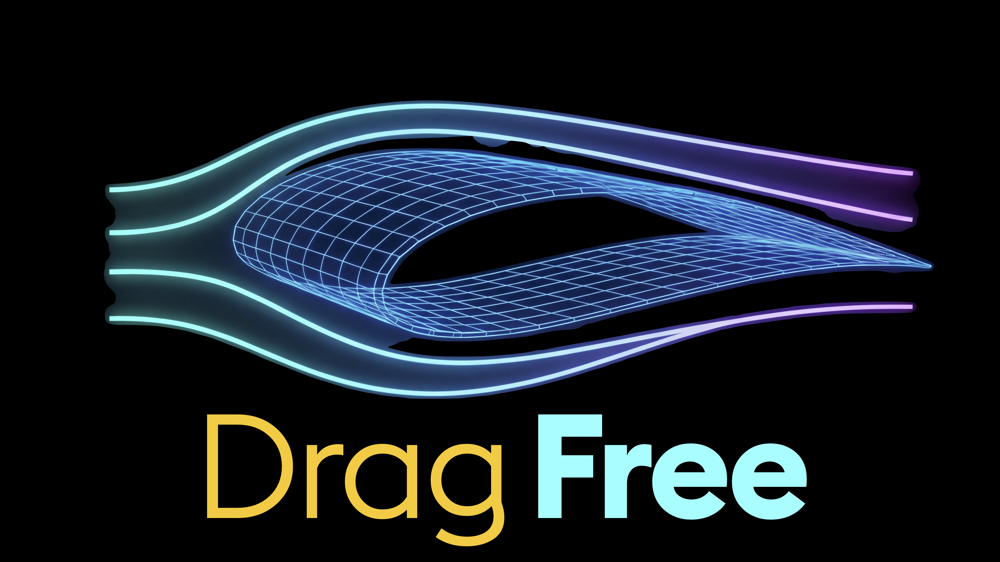

# Jesse Sng / Rebooted-Dev
**Building [Drag Free](https://dragfree.work): The AI-native dev workflow system.** 
*AI Code Builder · Church-planting Pastor · Neurodivergent Creator*

  
  
  
  

---

> [!NOTE]
> **The 45-Year Arc**
> `1980` Mentally wrote and debugged code on the bus.
> `1989` Launched 1st startup.
> `2001` Walked away after an IPO, became a Pastor.
> `2025` Unretired 24 years later to build with AI.

  <em>"Good workflow is invisible. You only notice it when it's gone."</em>

---

## 🚀 Featured: Drag Free
*(Currently tracking in the [Workflow Scripts](https://github.com/Rebooted-Dev/Workflow-Scripts) repository)*

> **Free yourself from dev housekeeping — by dragging and dropping the right file.**

One drag. One drop. The work happens.
- Works with Cursor, OpenCode, Windsurf, VS Code.
- Parallel-agent architecture with a unique filesystem-based memory structure.
- **[→ Learn more at dragfree.work](https://dragfree.work)**

---

I am building for communities that have been overlooked: neurodivergent, faith-rooted, Southeast Asian and persons with disabilities.

I've been on a 45-year arc from first code in 1980 to Hypertext, Digital Media information systems, Dotcom Voice Telephony to AI agent systems and apps today. ADHD/AuDHD isn't a footnote — it's the underlying operating system that drives my hyperfocus, the parallel processing and the refusal to accept "it can't be done" as an answer.

AI Vibe coding helped me discover I loved Designing and Building more than coding. I thought I left it behind for 24 yrs but AI app building found me and drew me back in.
**[→ The full 45-year arc](./STORY.md)**

---

## 🛠️ Active Projects
Coming back after 24 yrs (pre-Github and Building-in-public), I'm still getting used to the idea of putting stuff out. There's more to come as I do a lot of building for in-house use these days and there's very little requirement for me to bring things, especially the UI/UX up to Production standards. 
| Project                      | What It Is                                                                           | Link                                                                  | Status                                                                     |
| ---------------------------- | ------------------------------------------------------------------------------------ | --------------------------------------------------------------------- | -------------------------------------------------------------------------- |
| **Drag Free**               | AI-native dev workflow system focused on zero-friction execution from prompt to ship | [→ Repo](https://github.com/Rebooted-Dev/Workflow-Scripts)            |  |
| **Workflow Shell Project**   | Shell-first workflow tooling for repeatable execution and operations                 | [→ Repo](https://github.com/Rebooted-Dev/HyperPastaDev-Shell-Project) |    |
| **Personal Profile Prompts** | Copy/paste prompt sets for profile writing, positioning, and storytelling            | [→ Prompts](./PERSON-PROFILE-PROMPTS.md)                              |  |

## 🤖 Live Chatbots & Mini Apps
Mini apps using system prompts are very underrated. In the hands of a developer, you can quickly prototype lots of useful tools. I'm particularly interested in how AI Chatbots seem to be able to perform personal assessments of us. Take it with a pinch of salt but don't forget to have some fun with them!

| Bot / App                        | Focus                                    | ChatGPT                                                                                                                                                                                        | Gemini                                                                                                                                                                                  | Perplexity                                                                                                                                                            |
| -------------------------------- | ---------------------------------------- | ---------------------------------------------------------------------------------------------------------------------------------------------------------------------------------------------- | --------------------------------------------------------------------------------------------------------------------------------------------------------------------------------------- | --------------------------------------------------------------------------------------------------------------------------------------------------------------------- |
| **ND Buddy**                     | Neurodivergent support and guidance      |             |  |         |
| **The Sermonator**               | Sermon ideation and ministry prep        |       |  |     |
| **The Prompt Master**            | Prompt engineering and prompt refinement |  |  |      |
| **Bible Discovery Guide**        | Guided Bible study and discovery         |    |  |  |
| **QR Code Generator (Mini App)** | Generate QR codes from links or text     |                  | —                                                                                                                                                                                       | —                                                                                                                                                                     |

---

## 🤝 Connect

This is a builder's workshop, a research log, and a contact point. If something resonates — whether you're a neurodivergent creator, a church leader curious about AI, or a veteran builder who remembers the earlier waves — I'd genuinely like to hear from you.

> [!TIP]
> Whether you're a neurodivergent creator, a church leader curious about AI, or a veteran builder — I'd genuinely like to hear from you.

[→ hyper-pasta.dev](https://hyper-pasta.dev) · [X](https://x.com/Jesse_Sng) · [LinkedIn](https://www.linkedin.com/in/jesse-sng-05ab7944/) · [GitHub](https://github.com/Rebooted-Dev)

---

  
  
  

---
