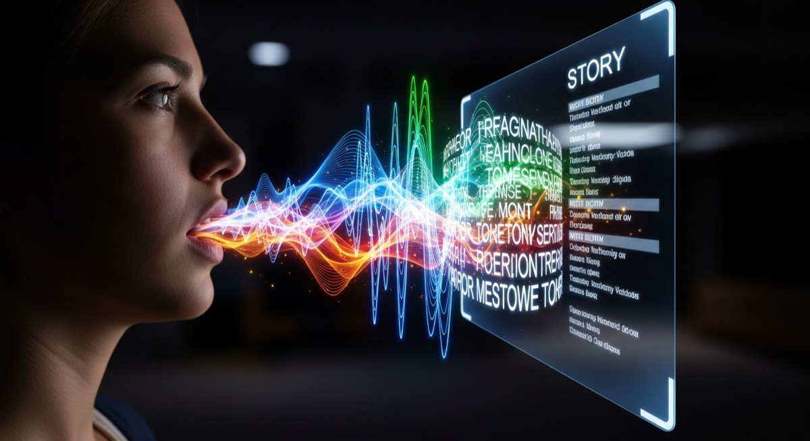

# The Full Story

> **TL;DR** — From attempted AI code in 1981 to production agent systems in 2025, via church planting, 12M-user scaling, and a 24-year detour that wasn't. A 45-year arc, told straight.
>
> *The short version: five computing waves, one 24-year detour, and why 2025 is different.*

  
  
  

---

## 🧒 1981 — Before the Vocabulary Existed

I was a teenager in Singapore when I wrote my first attempt at AI code.

The hardware had no business running it. The software ecosystem barely existed. The word "neural network" wasn't in my vocabulary — or most people's. But something in the way I was already thinking about systems made me point at a machine and ask: *what if it could reason?*

That question has never left.

What I didn't know then was that I was already wired differently — ADHD, AuDHD, a brain that compulsively sees systems, connections, and patterns that don't fit the expected shape. Neurodivergence wasn't a framework I had. It was just life. The hyperfocus that let me disappear into code for sixteen hours. The inability to accept "that's how it works" when I could see that it didn't have to. The parallel threads running simultaneously — a browser with too many tabs, all loading at once, none of them closing.

That cognitive architecture is the reason I was asking about AI in 1981. And it's the reason I'm still asking in 2025.

---

## 🌊 Five Waves, Ringside

Most people in the current AI moment have lived through one or two major democratisation waves in computing. I've lived through five — as a builder, not a spectator.

**Wave 1 — BASIC on personal computers.** The first time ordinary people could make a machine do something. I was there, on clunky hardware, learning that constraints aren't walls — they're puzzles with more interesting solutions.

**Wave 2 — dBASE and early databases.** Data became accessible without a mainframe. I learned that the real power was always in what you could ask the system, not just what it stored.

**Wave 3 — HyperCard.** This one shaped me most deeply. In my final year of college, I was modelling object-oriented messaging and autonomous systems across separate HyperCard stacks — before mainstream OOP vocabulary existed. My final-year project was a hypermedia museum archive. It was later featured in a BBC Horizon documentary. The abstraction-first, tool-agnostic architectural mindset that became my signature was forged here.

**Wave 4 — The Web.** Everything that seemed impossible became inevitable. I co-founded a startup and helped scale a platform called MediaRing from 300 to 12 million users. In 2001, I prototyped a P2P photo-sharing app that was roughly 15 years ahead of the infrastructure available to support it. The idea was right. The timing was wrong. I learned that being early and being right are not the same thing.

**Wave 5 — AI vibe-coding.** This is the current wave. And unlike the others, this one doesn't feel like it will plateau at "useful tool." It feels structural — a permanent shift in who can build what, and how.

I've watched every hype cycle in AI inflate and collapse since 1981. I know the difference between a feature and a foundation. This is a foundation.

---

## 🎓 1989 — The NUS Years and the First Real Builds

I completed my BSc in Computer Science at the National University of Singapore in 1989. The technical formation there was rigorous, but the ideas that have lasted came from what I was building *around* the curriculum — autonomous systems, hypermedia, and the conviction that the most interesting problems live at the intersection of disciplines.

Post-graduation, I founded a startup. I built engineering teams and R&D functions. I learned that leadership is just another form of debugging — of people, of incentives, of the invisible architecture of how groups actually work versus how they say they work.

---

## ⏳ Early 2000s — The Long Middle

In the early 2000s, I made a decision that most people in my technical world found baffling: I stopped building software.

Not because I'd burned out. Not because the work had lost meaning. Because something else had called more loudly — the desire to build *communities*, not just systems. I became a pastor. I planted churches. I held the kind of grief and hope that only happens when you're alongside people in the hardest chapters of their lives.

From 2006 to 2011, I held a dual role as Senior Pastor and Managing Director simultaneously — and learned that the same logic of systems applies to the soul. Empathy scales. Narrative scales. The invisible architecture of community follows rules as clear as any codebase, if you're willing to look.

For 24 years, I didn't write production code. That wasn't a gap. That was a different kind of building.

I remained deeply embedded in Singapore's neurodivergent community throughout — organising gatherings, advocating for employment pathways, holding space for people whose minds don't fit the standard mold. The pastoral and the neurodivergent work were never separate tracks.

---

## 🔄 2025 — The Unretirement

In early 2025, something shifted.

I'd been tracking AI progress since the beginning. Watching the hype cycles. Noting the genuine advances alongside the genuine nonsense. For most of the preceding decade, the gap between what AI could do and what I'd been imagining since 1981 was still wide enough to feel like a different conversation.

Then it wasn't.

The agent-like, autonomous reasoning architectures that I'd been carrying as a mental model since my HyperCard days — they were suddenly *real*. Not as demos. As deployable systems. The AI finally matched the cognitive model I'd been building toward for 45 years.

I came back.

Not as a software developer in the old sense. As a **builder** — with a 45-year pattern recognition advantage, a pastoral lens on how technology actually affects human communities, and a neurodivergent cognitive architecture that's genuinely suited to this moment's demands.

I estimate we have a 5–8 year window before AI becomes invisible infrastructure — before it's just the electricity that everything runs on, and the opportunity to shape *how* it serves communities like mine has passed. The window is open now.

---

## 🗺️ What the Arc Means

I'm not here because AI is exciting. I'm here because the communities I've spent 24 years serving — neurodivergent individuals, faith communities, the overlooked and differently-wired — deserve to have people who understand both the technology and them building the tools that will serve them.

Most AI tooling is built by people who have never sat with someone having a meltdown in a church office at 11pm. Who have never tried to explain an executive function strategy to someone who has failed every standard productivity system. Who have never watched a congregation try to adapt ancient wisdom to a digital world using tools built for a completely different kind of life.

I have. That's the irreplaceable context.

The 45 years aren't a credential. They're a map. And right now, knowing where we came from is one of the most useful things I can bring to where we're going.

> 🐧 *Still waddling on land. Absolutely flying in the water.*

---

  
  
  

